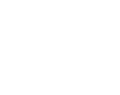

<h1>Culturama | Praticando CSS: Grid e Flexbox</h1>

Repositório com projeto do site da empresa fictícia Culturama desenvolvido durante o curso Praticando CSS: Grid e Flexbox da Alura Escola Online de Tecnologia.

<h2>:file_folder: Detalhes do projeto</h2> 

	

 

Culturama é uma página de divulgação de eventos culturais fictícia.

A aplicação foi desenvolvida com HTML e CSS puro. E a abordagem usada foi o mobile-first. Os breakpoints utilizados foram 360px, 720px e 1440px.

	
	
  

 

O initial commit é referente aos arquivos disponibilizados pelos instrutores do curso. Algumas adaptações foram feitas no projeto original com a finalidade de tornar o site mais responsivo.

	

 

<h2>:computer: Tecnologias utilizadas</h2>

	
	

